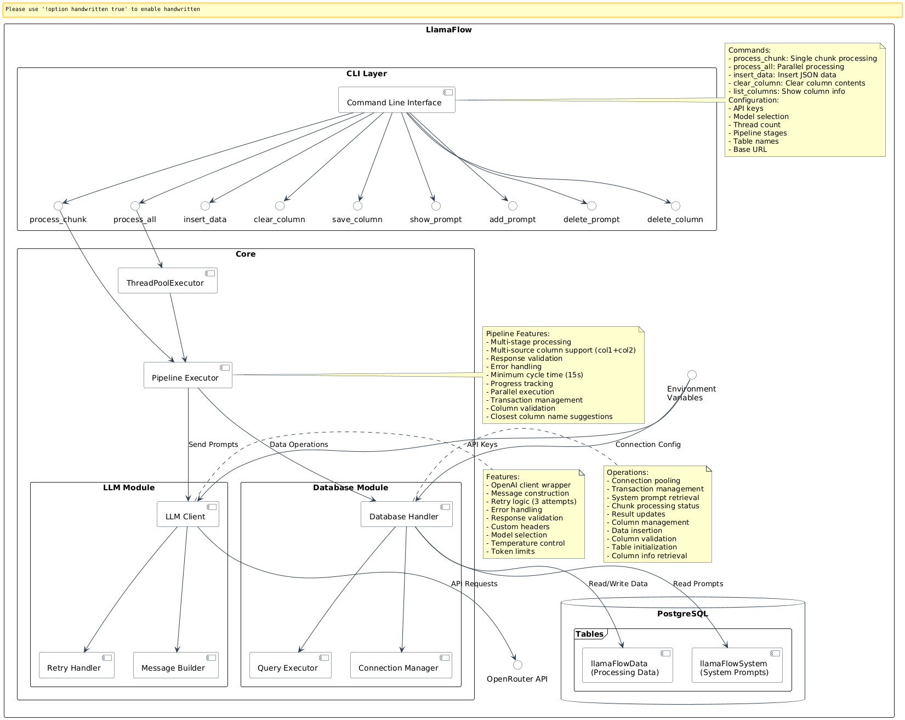

# cliDataForge CLI Documentation

cliDataForge provides a command-line interface for managing and executing LLM processing pipelines with PostgreSQL integration.


## Pipeline Stages

Pipeline stages are specified as comma-separated pairs of `source:destination` columns:

- `chunk:summary`: Generate summary from input chunk
- `summary:analysis`: Generate analysis from summary
- `analysis:conclusion`: Generate conclusion from analysis
- `src1+src2:combined`: Concatenate multiple source columns into one destination

Example pipeline specifications:
```bash
# Basic linear pipeline
--stages "chunk:summary,summary:analysis,analysis:conclusion"

# Using multiple source columns
--stages "title+content:summary,summary:analysis"
```

Each stage's processing is guided by system prompts stored in the system prompts table.
The pipeline automatically manages dependencies between stages and ensures data consistency.

### Multi-Source Columns

You can combine multiple source columns using the `+` operator:
- Source columns are concatenated with newlines between them
- All specified source columns must exist in the table
- This is particularly useful for combining related data (e.g., title and content)


## Architecture



## Global Options

These options are available for most commands:

- `--sys-table`: Name of system prompts table (default: 'cliDataForgeSystem')
- `--model`: Model to use (default: 'deepseek-chat')
- `--base-url`: Base URL for OpenAI-compatible API (default: 'https://api.deepseek.com')

Note: Most commands require a table name as their first argument. This is a required positional argument, not an option.

## Commands

### save-column

Save contents of specified column to a JSON file.

```bash
python -m clidataforge save-column TABLE_NAME OUTPUT_FILE --column COLUMN [options]
```

Arguments:
- `OUTPUT_FILE`: Path to save the JSON file
- `--column`: Required. Column to save

### show-prompt

Show the system prompt for a specific processing stage.

```bash
python -m clidataforge show-prompt TABLE_NAME STAGE [options]
```

Arguments:
- `STAGE`: The processing stage name

### add-prompt

Add or update system prompt for a processing stage from a file.

```bash
python -m clidataforge add-prompt TABLE_NAME STAGE PROMPT [options]

Options:
- `--from-file`: Treat prompt argument as a file path
```

Arguments:
- `STAGE`: The processing stage name
- `PROMPT_FILE`: Path to file containing the prompt

### delete-prompt

Delete the system prompt for a specific processing stage.

```bash
python -m clidataforge delete-prompt TABLE_NAME STAGE [options]
```

Arguments:
- `STAGE`: The processing stage name

### delete-column

Delete a column from the data table.

```bash
python -m clidataforge delete-column TABLE_NAME --column COLUMN [options]
```

Options:
- `--column`: Required. Column to delete

### process-all

Process all unprocessed chunks in parallel through the pipeline.

```bash
python -m clidataforge process-all TABLE_NAME --stages "source:dest[,source:dest...]" [options]
```

Options:
- `--api-key`: API key for LLM service (env: CLI_DF_API_KEY)
- `--base-url`: Base URL for OpenAI-compatible API (env: CLI_DF_BASE_URL)
- `--model`: Model to use (default: 'deepseek-chat')
- `--threads`: Number of parallel threads (default: 1)
- `--stages`: Required. Comma-separated list of source:destination pairs

Examples:
```bash
# Basic pipeline
python -m clidataforge process-all my_table --stages "chunk:summary,summary:analysis,analysis:conclusion" --threads 4

# Using multiple source columns
python -m clidataforge process-all my_table --stages "title+content:summary,summary:analysis" --threads 2
```

### process-chunk

Process a single unprocessed chunk through the pipeline.

```bash
python -m clidataforge process-chunk TABLE_NAME --stages "source:dest[,source:dest...]" [options]
```

Options:
- `--api-key`: API key for LLM service (env: CLI_DF_API_KEY)
- `--base-url`: Base URL for OpenAI-compatible API (env: CLI_DF_BASE_URL)
- `--model`: Model to use (default: 'deepseek-chat')
- `--stages`: Required. Comma-separated list of source:destination pairs

Examples:
```bash
# Basic pipeline
python -m clidataforge process-chunk my_table --stages "chunk:summary,summary:analysis"

# Using multiple source columns
python -m clidataforge process-chunk my_table --stages "title+body:summary"
```

### insert-data

Insert JSON list of text chunks into specified column.

```bash
python -m clidataforge insert-data JSON_FILE --column COLUMN [options]
```

Arguments:
- `JSON_FILE`: Path to JSON file containing list of text chunks
- `--column`: Required. Column name to insert data into

### clear-column

Clear all values in specified column (set to NULL).

```bash
python -m clidataforge clear-column --column COLUMN [options]
```

Options:
- `--column`: Required. Column to clear

### list-columns

List all columns in the data table with their types.

```bash
python -m clidataforge list-columns [options]
```

Shows detailed column information including data types and maximum lengths.

## Environment Variables

The following environment variables can be used:

- `CLI_DF_API_KEY`: API key for LLM service
- `CLI_DF_BASE_URL`: Base URL for OpenAI-compatible API service (default: 'https://api.deepseek.com')
- `CLI_DF_MODEL`: Model to use for completions (default: 'deepseek-chat')
- `DB_NAME`: Database name (default: 'llmdata')
- `DB_USER`: Database user (default: 'postgres')
- `DB_PASSWORD`: Database password
- `DB_HOST`: Database host (default: 'localhost')
- `DB_PORT`: Database port (default: '5432')

## Advanced Features

### Column Name Validation

The system validates column names and provides helpful suggestions if you mistype a column name:
```
Error: Source column 'titl' does not exist. Did you mean 'title'?
```

### Table Management

- Create tables with custom columns
- List all tables in the database
- View detailed column information
- Add, delete, or clear columns

### Prompt Management

- Store system prompts per table and stage
- View, add, update, or delete prompts
- Table-specific prompts with `table_name:stage` format

## Pipeline Features

- Multi-stage processing with configurable source/destination columns
- Multi-source column support (concatenate columns with `+`)
- Parallel processing with configurable thread count
- Automatic column creation and validation
- Progress tracking and error handling
- Retry logic for LLM API calls (3 attempts)
- Transaction management for database operations
- System prompt management (add/update/delete/show)
- Column management (create/delete/clear/save)
- Detailed column information display
- JSON data import/export capabilities
- Column name validation with suggestions
- Table-specific system prompts
